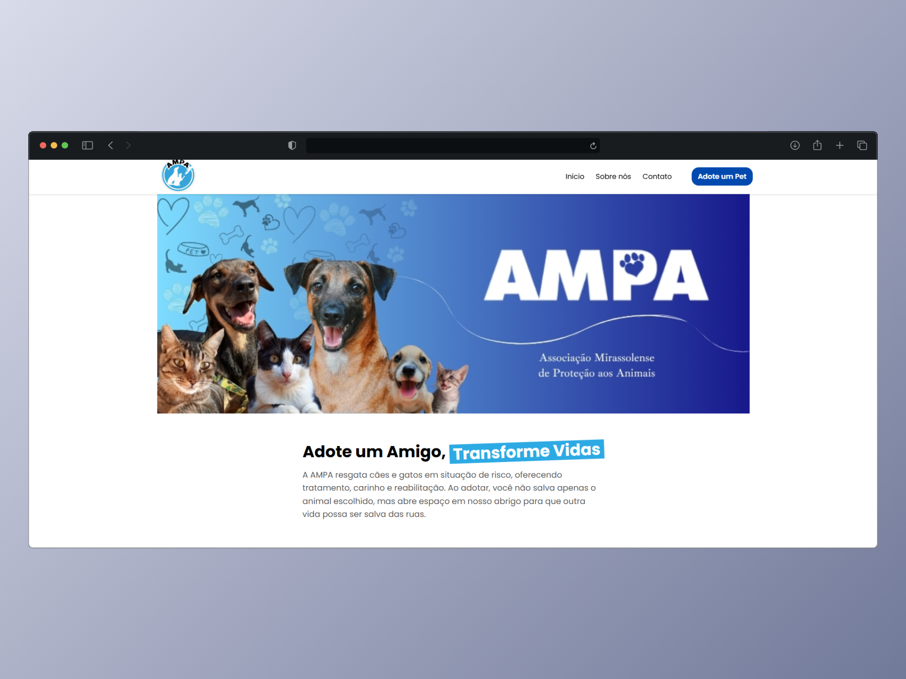
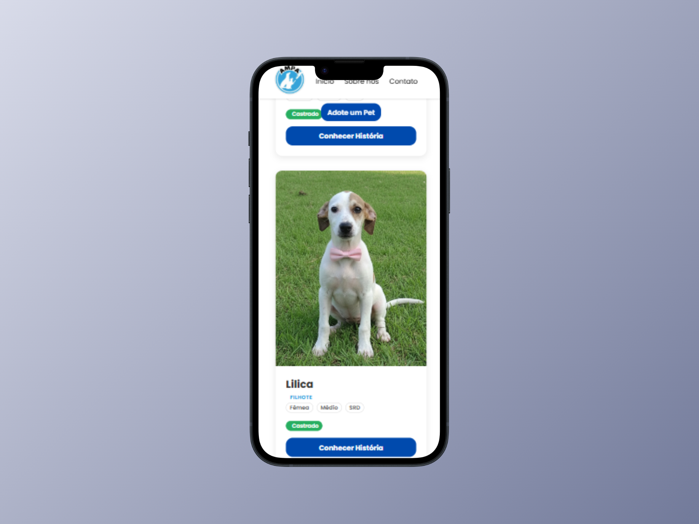
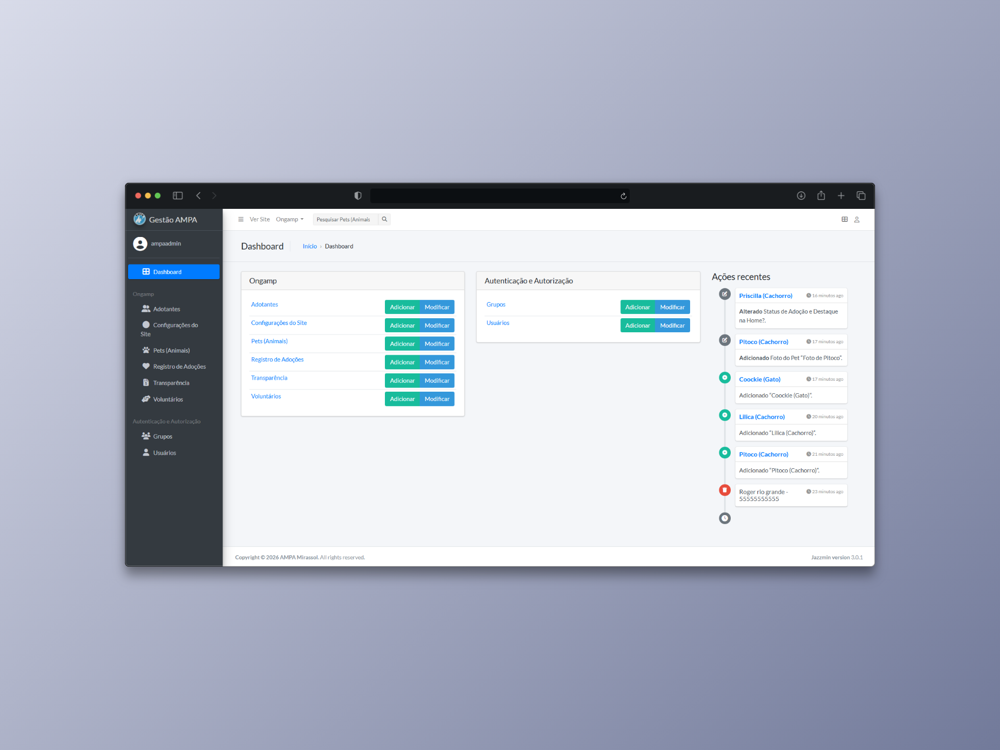

# Portal AMPA - Gestão de Adoção e Doações
> Uma plataforma Full-Stack desenvolvida para modernizar a **Associação Mirassolense de Proteção aos Animais (AMPA)**, conectando pets a novos lares e facilitando a gestão interna da ONG.

---

## Screenshots

### Vitrine de Adoção (Front-end)
Interface limpa e amigável para destacar os animais disponíveis.


### Mobile First & Responsividade
Foco total na experiência mobile, onde ocorre a maioria dos acessos. Adaptação de grids complexos para navegação fluida em telas pequenas.


### Painel Administrativo (Back-end)
Dashboard customizado para que voluntários gerenciem cadastros de animais, adotantes e status de adoção sem precisar tocar em código.


---

## Objetivo do Projeto

A AMPA realizava a gestão de animais e doações de forma manual e descentralizada. O objetivo deste projeto foi criar um **Hub Digital** que resolve duas dores principais:
1.  **Para o Público:** Facilitar a visualização dos animais, suas histórias e os dados bancários (PIX) para doação.
2.  **Para a ONG:** Prover um sistema seguro e centralizado para cadastro e controle (CRUD) dos animais resgatados.

---

## Tecnologias Utilizadas

O projeto segue a arquitetura **MVT (Model-View-Template)** do Django.

### Back-end
-   **Python & Django:** Framework principal para regras de negócio, rotas e segurança.
-   **Django Admin Customizado:** Personalização da interface administrativa (Jazzmin/Grappelli) para uso de não-desenvolvedores.
-   **SQLite (Dev):** Banco de dados relacional.

### Front-end
-   **HTML5 Semântico & CSS3:** Estilização moderna sem dependência de frameworks pesados (foco em performance).
-   **JavaScript (Vanilla):** Interatividade leve (menu mobile, modais).
-   **Django Templates:** Renderização dinâmica de dados do servidor.

---

## Metodologia: AI-Augmented Development

Este projeto serviu como um laboratório prático de **Engenharia de Prompt** e **Vibe Coding**.
Além do desenvolvimento tradicional, utilizei LLMs (Modelos de Linguagem) para acelerar o fluxo de trabalho de Front-end:

* **Visual Debugging:** Utilização de modelos multimodais para analisar *screenshots* de erros de layout mobile e gerar correções de CSS precisas.
* **Iteração Rápida:** Refatoração de componentes de interface baseada em contexto visual, reduzindo o tempo de desenvolvimento da responsividade em 50%.

---

## Funcionalidades Principais

-   [x] **Catálogo de Animais:** Listagem dinâmica com fotos, nome, idade e status (Castrado/Vacinado).
-   [x] **Página de Detalhes:** "Storytelling" do animal para aumentar as chances de adoção.
-   [x] **Sistema de Filtros:** (Em desenvolvimento) Filtragem por espécie (Cão/Gato) e porte.
-   [x] **Área Administrativa:**
    -   Login seguro para voluntários.
    -   Upload e gerenciamento de fotos dos pets.
    -   Dashboard com métricas rápidas.
-   [x] **Design Responsivo:** Layout adaptável para Desktop, Tablet e Mobile.

---

## Como rodar o projeto localmente

```bash
# 1. Clone o repositório
git clone [https://github.com/SEU-USUARIO/NOME-DO-REPO.git](https://github.com/SEU-USUARIO/NOME-DO-REPO.git)

# 2. Entre na pasta
cd NOME-DO-REPO

# 3. Crie um ambiente virtual (Recomendado)
python -m venv venv
source venv/bin/activate  # No Windows: venv\Scripts\activate

# 4. Instale as dependências
pip install -r requirements.txt

# 5. Aplique as migrações do banco de dados
python manage.py migrate

# 6. Crie um superusuário para acessar o admin
python manage.py createsuperuser

# 7. Rode o servidor
python manage.py runserver
